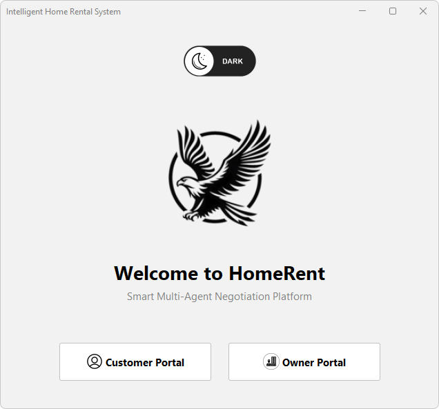
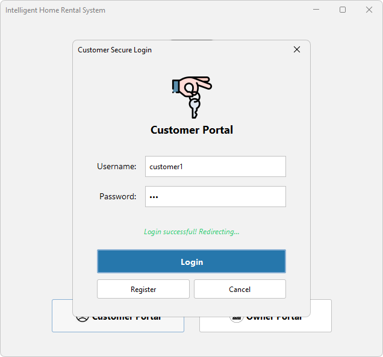
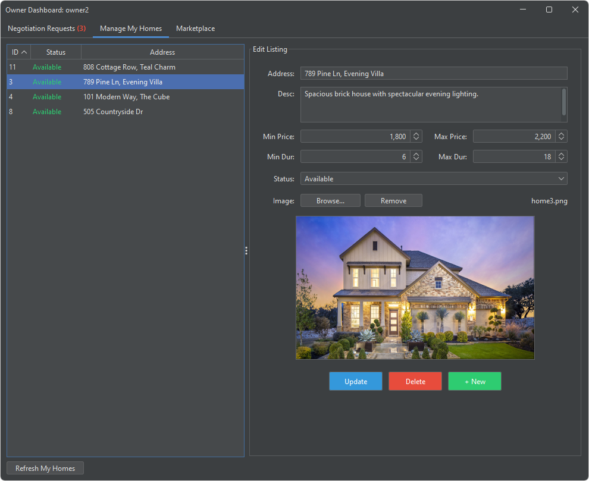
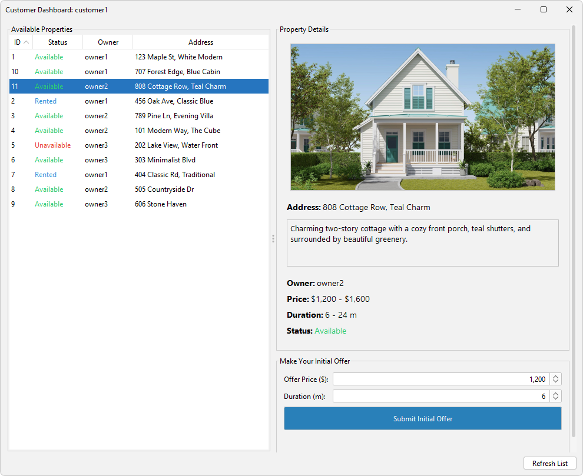
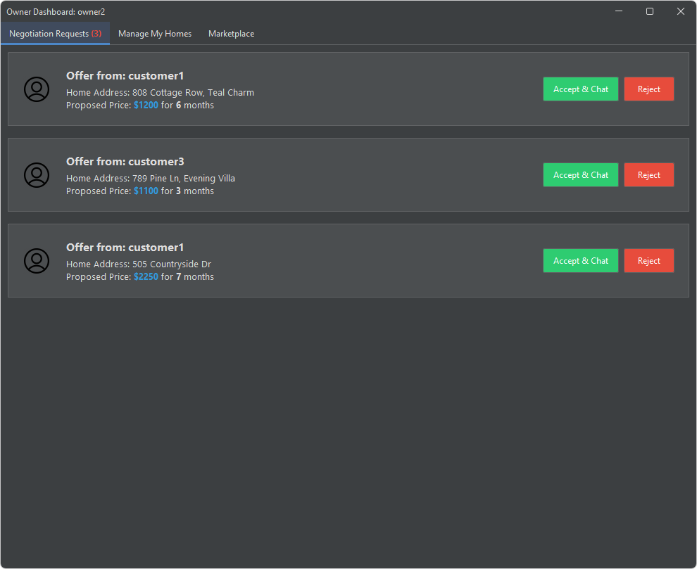
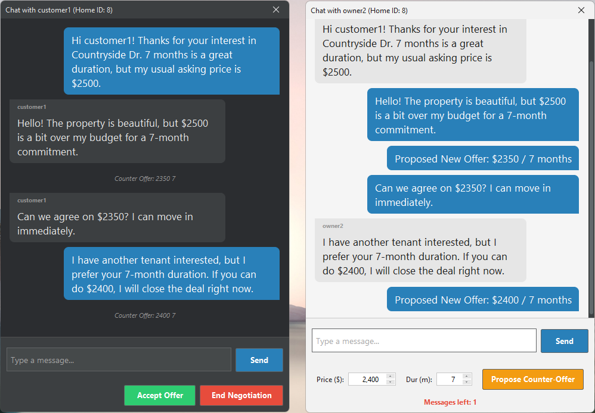
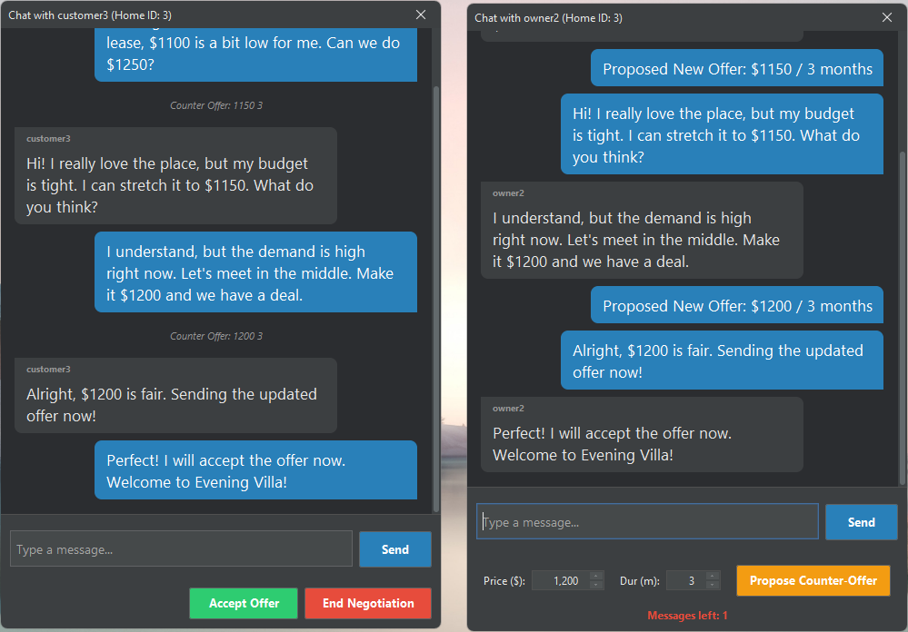
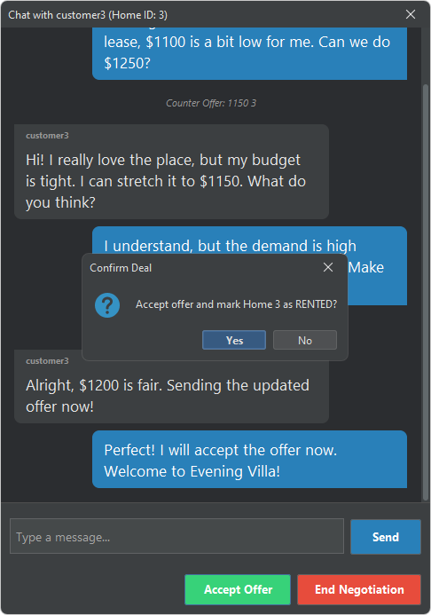
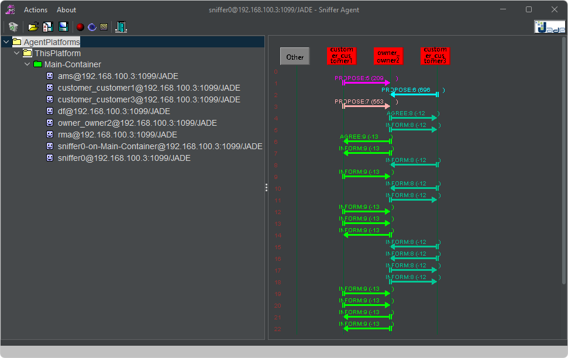

<h1 align="center">🏡 Intelligent Home Rental System (MAS)</h1>

  
  
  
  
  

  

An advanced **Multi-Agent System (MAS)** built with Java and the **JADE (Java Agent Development Framework)**. This project simulates a real-world intelligent real estate marketplace where autonomous agents (Customers and Owners) negotiate rental prices and durations in real-time.

## ✨ Key Features

* **🤖 Autonomous Multi-Agent Architecture:** Utilizes JADE to deploy independent `CustomerAgent` and `HomeOwnerAgent` entities that interact asynchronously.
* **⚡ Real-Time Concurrent Negotiation:** Owners can seamlessly handle multiple negotiation streams with different customers simultaneously without UI blocking or thread deadlocks.
* **💬 Intelligent FIPA ACL Communication:** Agents communicate using standard ACL protocols (`PROPOSE`, `AGREE`, `REFUSE`, `INFORM`, `CANCEL`).
* **🎨 Modern UI/UX (FlatLaf & MigLayout):** 
  * Dynamic theme switching: Centralized **Dark/Light Mode** toggle that inherits across all portals and dialogs.
  * Custom styled chat dialogs with rounded bubbles, message limits, and smart `JSpinner` data binding.
* **🗄️ Robust Database Integration:** Powered by MySQL and **HikariCP** for high-performance connection pooling.
* **📊 Live Sniffer Tracking:** Fully compatible with JADE Sniffer for deep inspection of agent message routing.

---

## 📸 System Walkthrough & Screenshots

### 1. Smart Launcher & Secure Login
The centralized entry point featuring a dynamic global theme toggle (Dark/Light). Each agent has a dedicated, secure login portal that authenticates directly with the database before spawning the JADE agent.

  

### 2. Secure Dashboards (Role-Based)
Owners manage properties in a sleek environment, while Customers browse available listings. The UI dynamically adapts based on the active theme.

  
  

### 3. Live Concurrent Negotiations
When a customer submits an initial offer, it appears in the Owner's "Negotiation Requests" tab. Upon acceptance, a real-time negotiation chat opens.

  

Agents can propose counter-offers seamlessly. The system dynamically tracks prices, durations, and enforces conversational message limits.

  
  

### 4. Deal Confirmation & Real-time State Updates
Once an agreement is reached, the Owner confirms the deal, automatically updating the database and marking the property as "Rented" across all active agents.

  

---

## 🔬 Under the Hood: Concurrency & MAS Logic

One of the most powerful features of this system is its ability to handle **Concurrency**. 

> **Real-time Concurrency Demonstration:** As shown in the JADE Sniffer capture below, `owner2` successfully handles multiple concurrent asynchronous negotiation streams (ACL Messages) with `customer1` and `customer3` simultaneously. The agents process these messages via non-blocking `CyclicBehaviour` loops, ensuring a fluid Multi-Agent architecture without locking the Swing UI thread.

  

### Agent Interaction Flow:
1. **Customer** sends a `PROPOSE` message containing `[HomeID; Price; Duration]`.
2. **Owner** receives it. The GUI prompts the user to Accept/Reject.
3. If Rejected, Owner sends a `REFUSE` message (securely passing the `ConversationID` to prevent state corruption).
4. If Accepted, Owner sends an `AGREE` message. Both agents open an isolated chat session.
5. Inside the chat, agents exchange `INFORM` messages (`chat-message` and `counter-offer` ontologies).
6. Upon finalizing the deal, the Owner agent broadcasts a system-level `INFORM` to terminate the negotiation state.

---

## 🛠️ Environment & Dependencies

### Prerequisites
* **IDE:** Eclipse IDE for Java Developers (Tested on **Oxygen.3a Release 4.7.3a**)
* **Java:** JDK 8 or higher
* **Database:** MySQL Server

### External Libraries (`lib` folder)
Ensure the following `.jar` files are added to your project's Build Path:
* `jade.jar` (JADE Framework)
* `flatlaf-demo-3.6.jar` (Modern UI Theme)
* `HikariCP-4.0.3.jar` (High-performance JDBC connection pool)
* `mysql-connector-j-9.2.0.jar` (MySQL Driver)
* `slf4j-api-2.0.18.jar` & `slf4j-simple-2.0.18.jar` (Logging framework for HikariCP/JADE)

---

## 🔌 Database Setup & Auto-Seeding

1. Ensure your **MySQL Server is running** locally (e.g., via XAMPP or WAMP).
2. Update the DB credentials (username/password) in `DatabaseHelper.java` to match your local setup (The default is usually `root` with a blank password).
3. **Zero-Config Magic:** You DO NOT need to create the databases manually. On the very first run, the system will automatically:
   * Create the required databases (`owner_auth_db` and `customer_auth_db`).
   * Generate all necessary tables (`homes`, `offers`, `users`).
   * **Inject default test data** (mock owners, customers, and properties with images fetched from the `home_images/` directory).

### 🔑 Default Test Accounts
To quickly test the platform and negotiation features without registering new users, use the following pre-configured accounts:

| Role | Usernames | Password |
| :--- | :--- | :--- |
| **Owner** | `owner1`, `owner2`, `owner3` | `123` |
| **Customer** | `customer1`, `customer2`, `customer3` | `123` |

---

## 🚀 Running the Application

1. Launch the **JADE Main Container** and RMA GUI.
2. Compile and run `MainGui.java` to start the Intelligent Home Rental System launcher.
3. Spawn your Customer and Owner agents simultaneously from the interactive login portal and start negotiating!

---

## 👨‍💻 Author

**Bouroga Ramdane** 
*Master's Student in Artificial Intelligence and Data Science*
Specializing in Computer Vision, Deep Learning, and Multi-Agent Systems.

---
*Feel free to star ⭐ this repository if you found it useful!*
